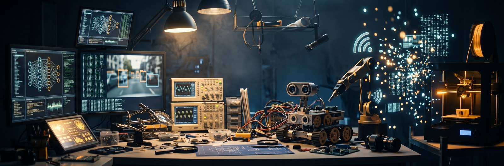

 

 

 

---

## 🧭 About me

I'm an **Electrical & Electronic Engineering** undergraduate at the **University of Sri Jayewardenepura**, with a minor in **Electronics & Telecommunication Engineering**.

I learn by building. Whatever I pick up ends up inside something that actually runs — a churn model a telecom team could act on tomorrow, a lane detector that still finds the road at night, an offloading planner that keeps edge servers from saturating. The work I enjoy most sits where **intelligent software meets real hardware**: a model on one side, a camera, a sensor or a microcontroller on the other, and a decision in between that has to be right and explainable.

**My technical interests**

`Computer Vision` · `Artificial Intelligence & Machine Learning` · `Robotics & Industrial Automation` · `Electronics & Telecommunication` · `Embedded Systems, IoT & Edge Computing` · `Power Systems & Renewable Energy`

**Right now**

- 🛰️ Team leader of **Falconyx** — finalists at **IgnitX by Hutch 2026** with [StaySignal](https://github.com/projectswyaneth/staysignal)
- 📚 Studying Supervised Machine Learning (Stanford / DeepLearning.AI) and industrial **PLC automation** (CGTT Rathmalana)
- 🌙 Just finished a hybrid classical + deep-learning [low-light image denoiser](https://github.com/projectswyaneth/low-light-image-denoising) for **Mora SP Cup 2026**
- 🤝 Keen to connect with engineers and researchers, and to contribute to substantive engineering work

---

## 🚀 Featured projects

<table>
<tr>
<td width="50%" valign="top">

### 🛰️ [StaySignal](https://github.com/projectswyaneth/staysignal)
**IgnitX by Hutch 2026 · Finalist · Track B**

Prepaid customers never cancel — they go quiet. StaySignal scores every customer nightly on the chance they go silent within 30 days, diagnoses *why* from network, usage, billing and market data, and routes the matching recovery action.

An explainable linear model that **beats a gradient-boosting benchmark** (0.840), so transparency costs nothing here. It holds up on the cases that fool naive models: holiday travellers, field reps on new towers daily, competitor promotions.

**Python · scikit-learn · Flask · JavaScript · Netlify**

[▶ Live console](https://staysignalbyfalconyx.netlify.app) · [Repository](https://github.com/projectswyaneth/staysignal)

</td>
<td width="50%" valign="top">

### 🌙 [NightDrive ADAS](https://github.com/projectswyaneth/nightdrive-adas-vision)
**Vision-based driver assistance for night driving**

A real-time pipeline on live dashcam video: lane detection tuned for darkness and glare with CLAHE and adaptive thresholding, where fixed-threshold methods fail completely; vehicle detection and classification; distance estimation; and multi-language licence-plate OCR with a sharpness filter that discards unreliable reads rather than reporting wrong ones.

Detection stages run at independent frame intervals, so four tasks stay real-time together.

**Python · OpenCV · YOLOv8 · Tesseract OCR**

[Repository](https://github.com/projectswyaneth/nightdrive-adas-vision)

</td>
</tr>
<tr>
<td width="50%" valign="top">

### 🌙 [Low-Light Image Denoising](https://github.com/projectswyaneth/low-light-image-denoising)
**Mora SP Cup 2026 · Team Falconyx**

Measure the noise before choosing the model. A blind Poisson–Gaussian estimate feeds a Generalised Anscombe Transform, which flattens signal-dependent sensor noise into unit variance — so one denoiser setting works across the whole intensity range instead of needing adaptive strength per brightness.

On top of that sits a **472 K-parameter residual U-Net** that predicts the noise to subtract rather than rebuilding the image — small enough to run tiled on a laptop CPU in 1.27 s per 992×992 frame. Validation on 40 never-trained images caught that longer training was quietly making generalisation *worse*.

**Python · PyTorch · NumPy · scikit-image · OpenCV**

[Repository](https://github.com/projectswyaneth/low-light-image-denoising)

</td>
<td width="50%" valign="top">

### ⚙️ [Ultra-Precision V/I Meter](https://github.com/projectswyaneth/ultra-precision-vi-meter)
**STM32 bench instrument · bare-metal firmware**

A handheld meter reading DC voltage to four decimal places and current down to microamps, on a 16×2 LCD with Bluetooth telemetry to a phone.

The resolution comes from refusing to trust a raw ADC read. Every displayed value is the mean of 16 conversions (√N noise reduction), minus a zero-offset measured from **512 samples at first boot** and kept in a `.noinit` RAM section behind a magic word — so it survives a reset instead of recalibrating every power-up. Current goes to an **INA226** across a 0.1 Ω shunt, hardware-averaged before the MCU ever reads it.

The LCD is only rewritten where a digit actually changed, so a steady reading sits perfectly still rather than flickering between neighbouring counts.

**C · STM32 HAL · INA226 · I²C · UART · PCB design**

[Repository](https://github.com/projectswyaneth/ultra-precision-vi-meter)

</td>
</tr>
<tr>
<td width="50%" valign="top">

### 📡 [MEC Task Offloading Optimizer](https://github.com/projectswyaneth/mec-task-offloading-optimizer)
**Energy-aware task offloading for 5G mobile edge computing**

Twenty phones, three edge servers, one question: who computes locally and who offloads where? Each device picking its own fastest server looks optimal and isn't — everyone picks the same one, it saturates, and tasks start missing deadlines. Edge servers are shared, so one device's choice changes everyone else's latency.

A genetic algorithm searches whole assignment plans rather than per-device choices, scoring total energy with a hard penalty per missed deadline, and raising its mutation rate when progress stalls. Validated against exhaustive search on small networks, then benchmarked over 60 random ones.

The honest result: **energy came out level with greedy in 47 of 60 networks** — the win is feasibility and load balance, not power. Greedy left a task late in 35 networks against 12, and peaked at 15.7 devices on a 10-device server against 7.3. The GA still scales: 1,000 devices in 3.3 s.

The browser runs the same engine as the Python backend — a JavaScript port verified field-for-field across 9 configurations, so the live demo isn't an approximation of the real solver.

**Python · Flask · JavaScript · Genetic algorithms · Firebase · Netlify**

[Repository](https://github.com/projectswyaneth/mec-task-offloading-optimizer)

</td>
<td width="50%" valign="top">

### 👶 [cPebble — Smart Child Safety Band](https://github.com/projectswyaneth/cpebble)
**Two-band wearable: vitals and location, parent to child**

A child band and a parent band. The child band reads heart rate, body temperature and GPS position, packs them into one telemetry packet every two seconds, and sends it over **ESP-NOW** — peer to peer, no Wi-Fi router, so it keeps working in a park or a power cut where anything router-based goes dark.

The parent band joins Wi-Fi and serves its own dashboard showing the child on Google Maps alongside live vitals, with an optional Firebase path feeding an Android app. Heart rate is a rolling average over 10 beats rather than a raw per-beat reading, so the number on screen stays steady enough to act on.

My part was the sensing subsystem on the child band: DS18B20 temperature over OneWire and a MAX30102 pulse sensor over I²C on an ESP32-C3.

**ESP32-C3 · C++ · ESP-NOW · I²C · OneWire · GPS · Firebase · Android**

> Student prototype, not a medical device.

[Repository](https://github.com/projectswyaneth/cpebble)

</td>
</tr>
</table>

> 🔧 **In progress:** *NightDrive Copilot* — question answering and automatic trip reports over night dashcam footage, built on the NightDrive pipeline.

---

## 🛠️ Tech stack

**Languages**

**Machine Learning & Computer Vision**

**Web & Cloud**

**Hardware & Tools**

---

## 📈 GitHub activity

---

<!-- ===================================================================
     3D CONTRIBUTION CALENDAR + SNAKE
     Switch this on AFTER both GitHub Actions have run successfully:
       1. Settings > Actions > General > Workflow permissions
          -> "Read and write permissions" -> Save
       2. Add .github/workflows/profile-3d.yml and snake.yml
       3. Actions tab -> run each workflow once
       4. Delete this comment line and the closing one below
=====================================================================
## 🧊 Contributions in 3D

 

---
===================================================================== -->

## 🎯 Open to

---

## 🌱 Beyond the code

- 🏆 **Team leader, Falconyx** — finalists, IgnitX by Hutch 2026
- 💼 **Treasurer**, IEEE Signal Processing Society Student Chapter, USJ — ran the MATWave MATLAB/DSP workshop series
- 🧩 **Core Team Leader**, IET on Campus, University of Sri Jayewardenepura
- 🤝 **Member**, Industrial Relations Committee, IEEE PES Student Chapter, USJ
- ⚾ University baseball team — 4th place, Inter-University Tournament 2024

⭐ *Start with* **[StaySignal](https://github.com/projectswyaneth/staysignal)** *— or open the* **[live console](https://staysignalbyfalconyx.netlify.app)**

